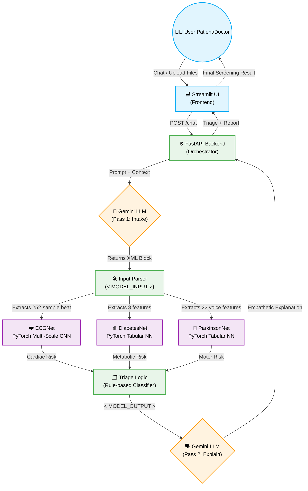
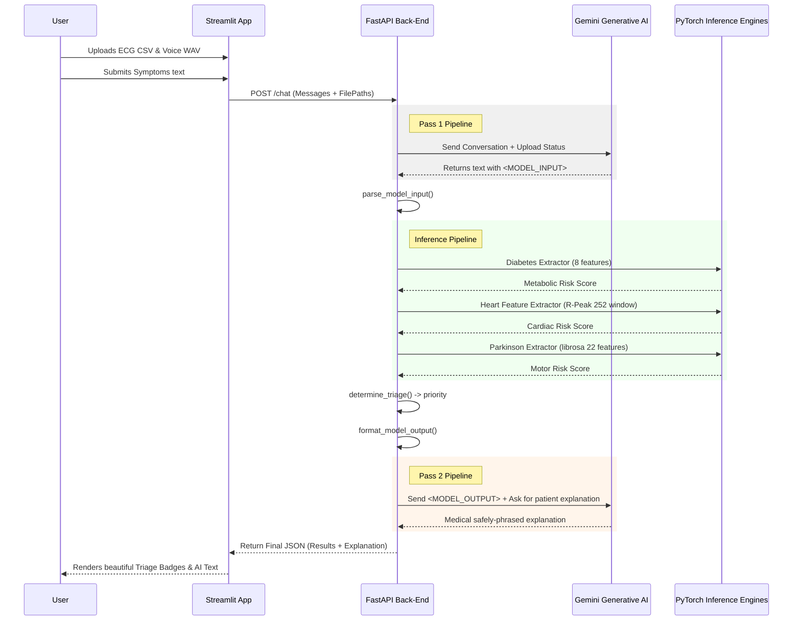
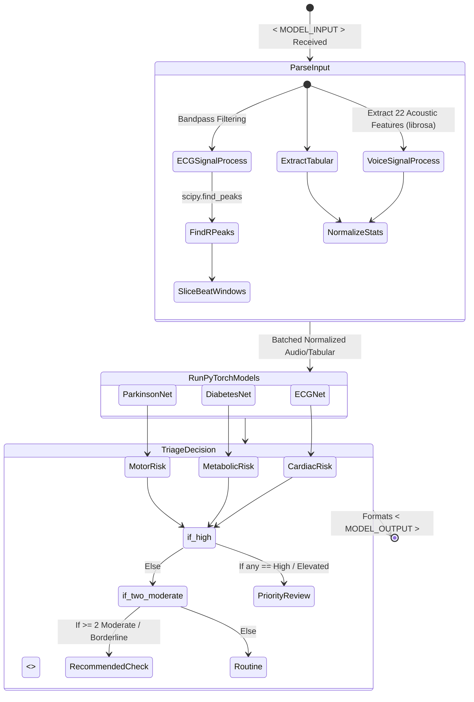

# Capstone Project Diagrams

Here are the Mermaid LaTeX compatibility diagrams you can directly embed into your LaTeX report using the `\usepackage{mermaid}` or by pasting the mermaid code into a Mermaid-to-PDF online generator (like Mermaid Live Editor) and using `\includegraphics`.

## 1. System Architecture Pipeline (Flowchart)
This is a detailed layout of the backend processes and model routing you described in Chapter 4.

## 2. Sequence Diagram (Chat Endpoint Execution Flow)
Tracks the exact lifecycle of the FastAPI `/chat` endpoint logic.

## 3. Detailed Inference Workflow (Triage Subsystem)

